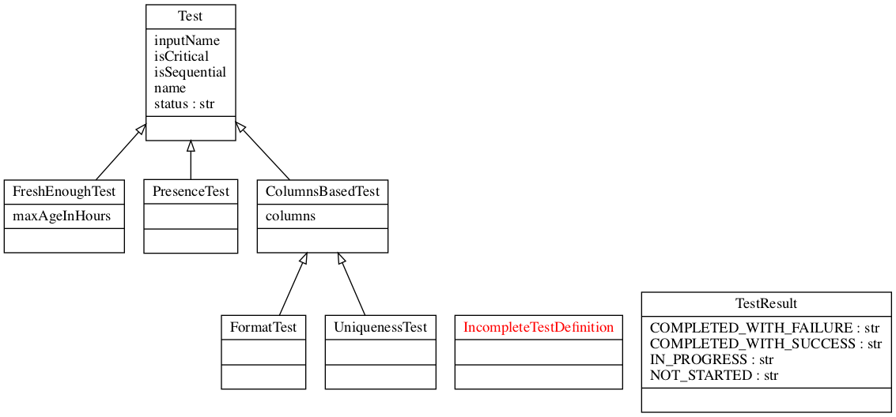
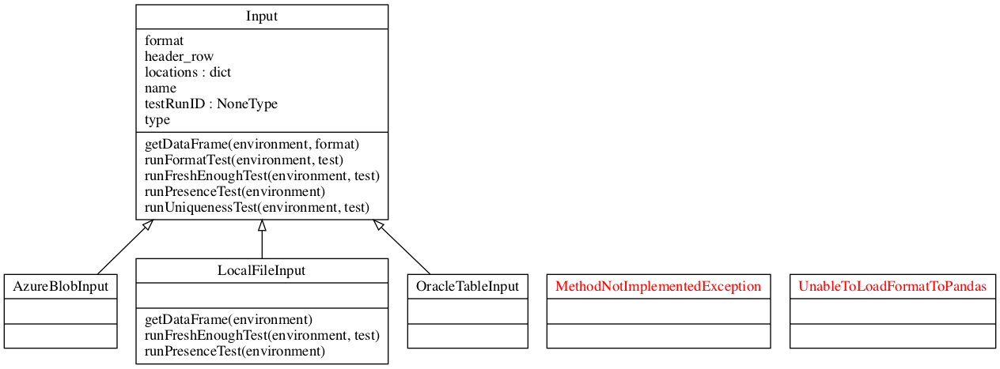
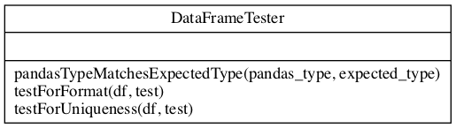

# dummit
dummy input tests (spelled /ˈdamɪt/)

nothing to be seen here.

### Tests

### Inputs

### DataFrame Based Tests

### And all the rest

just an attempt to start a skeleton for simple (i.e. dummy) input tests

use at your own risk, comply with license terms (viral on purpose)