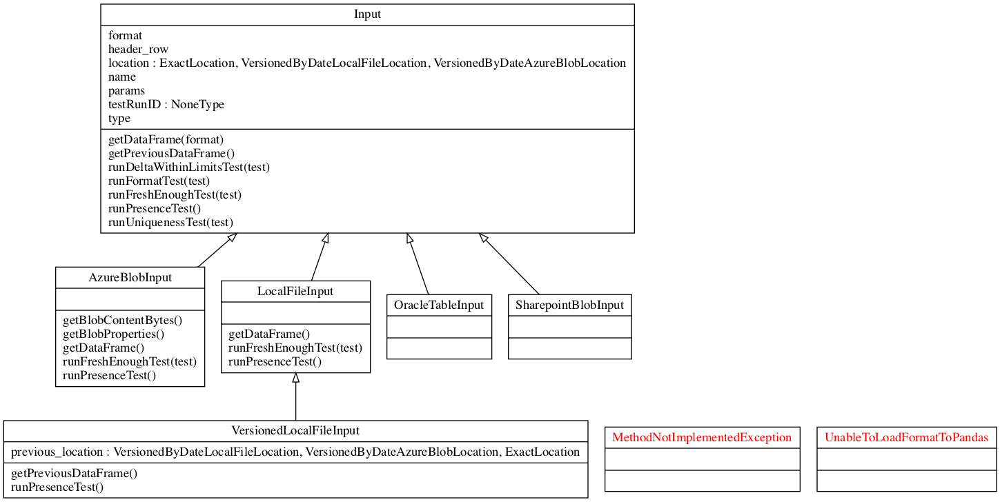
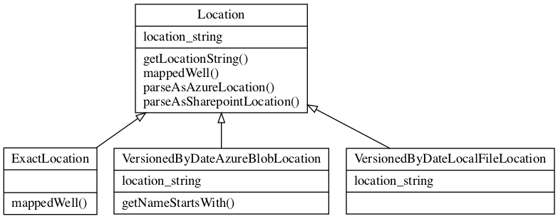
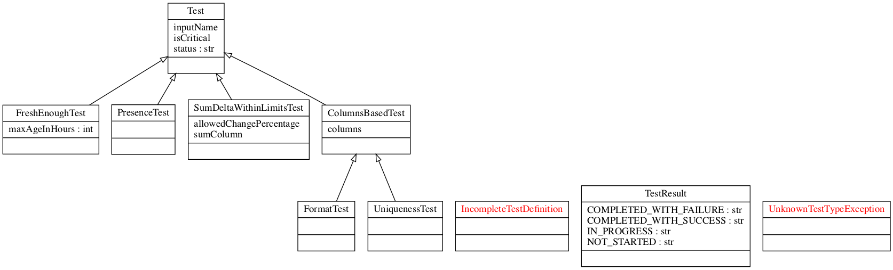
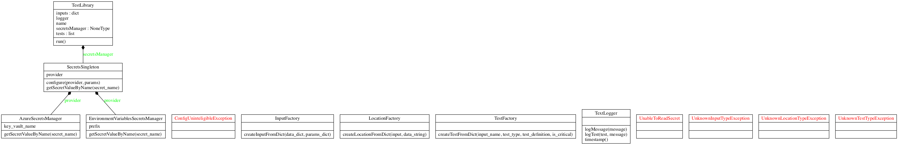

# dummit
dummy input tests (spelled /ˈdamɪt/)

nothing to be seen here just an attempt to start a skeleton for simple (i.e. dummy) input tests.

## See it in action:

```bash
# get the code
git clone git@github.com:Piotr12/dummit.git
# install the package (can also use the local one if you know how)
pip install dummit
# run a sample demo,sample files are included in the repo, just a dummy csv ones. 
. ./run_demo.sh
```


## Learn more: 
The idea behind dummit is to make things as abstract as possible (below class diagrams should help to visualize this a tiny bit). Then reuse the common sauce for specialized tests. Not only for input but also for output / intermittent artifacts.

Key abstractions:
+ **Input** - either a file, or an Azure blob, or a SQL query output. A set of files, a directory with its contents. Just extend the Input class and you have your Input covered.
+ **Locations** - either an exact label or some kinds of a mask. Also with *'yyyymmdd'* timestamping to allow for "not changed significantly vs last week input" tests. Again - just a skeleton here, you can add yours as needed. 
+ **Tests / DataFrame Tests** - abstract tests that are run on an Input (or its abstraction, via pandas.DataFrame) after getting the config injected 
  + Example: Check if there no duplicates in column 'x', with x being filled at the very last minute for the test vs hardcoded. 

Sample [config file](demos/sample_local_files_config.yaml) (local files) is a first place to look at. 

Azure based inputs are a bit more tricky, you need to set a ConnectionString or even better use Azure KeyVault. Do not step in if thats Hungarian to you, learn the Azure Basics first (check the azure libs I do have included and learn their basic use).

### Inputs


### Locations


### Tests


### DataFrame Based Tests


### And all the rest


## Performance
I have not tested it on large blobs, partitioned parquets. At least not yet. What is on my mind you can decide to implement a 'LargeInput' class that will just test some sample of the final one. Just thinking loud for now. 