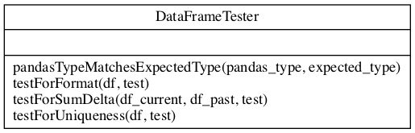

# DataFrame based tests

The following tests are implemented to be run on a pandas.DataFrame (or a set of DataFrames if that is the need):

+ **be_well_formated** - are Integers where we expect them, how about Strings?
+ **have_no_duplicates_for_a_key_of** - if we expect just a single entry for a particular key, is it really the case? 
+ **have_sum_delta_within_limits** - sample code for a two DataFrames test - comparison of sum between two versions.

All rely on the fact that each Input can present itself as a DataFrame - and the code in the test takes over when DataFrame is there, you just inject the params via the config, hey presto and the test is there ready for running.

## Class Diagram
